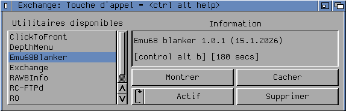

## Name

Emu68Blanker

## Author

Philippe CARPENTIER (flype)

## Repository

https://github.com/flype44/Emu68Blanker

## Requirements

An Amiga equipped with a PiStorm and Emu68.

It also needs mandatory Emu68 version 1.0.999+

## Description

Emu68Blanker is a very simple screensaver for PiStorm/Emu68.

The only purpose of this program is to display the builtin 
Emu68 boot screen after some delay of user inactivity.

## Installation

Copy the Emu68Blanker file and the .info in the SYS:WBStartup 
folder.

Then edit the icon tooltypes to customize the HOTKEY 
and the DELAY tooltypes.

DELAY allows to define the user inactivity, in seconds.

## Additional notes

The builtin Emu68 boot screen can be gray, black or purple.

This is configurable in the Emu68 SDCard cmdline.txt file.

Eg. logo=black, or logo=purple, or unset for gray.

## Programming notes

This program was written as an example on how to use the new 
mailbox.resource present in the Emu68 1.0.999+ builtin ROM.

The headers for this resource are embedded in the Emu68-Tools
package.

See https://github.com/michalsc/Emu68-Tools/releases

Amiga Rulez!
